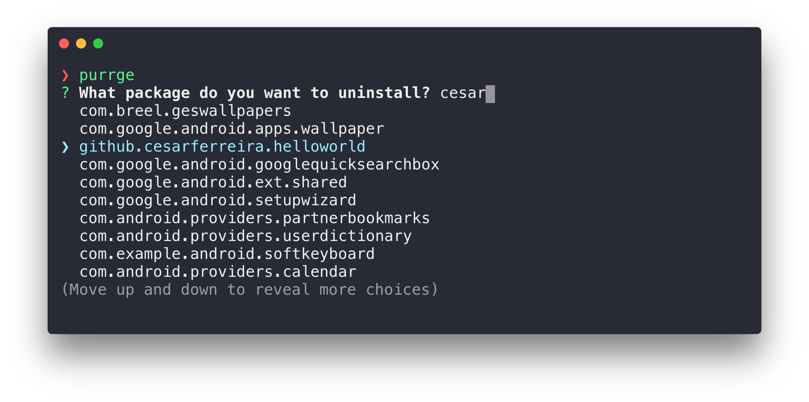

# purrge
> Quickly uninstall android apps

<p align="center">
  
</p>

[](https://travis-ci.org/cesarferreira/purrge)
[](https://www.npmjs.com/package/purrge)
[](https://www.npmjs.com/package/purrge)

## Install

```sh
npm install -g purrge
```

## Usage

```
Usage
   $ purrge
```

## Created by
[Cesar Ferreira](https://cesarferreira.com)

## License
MIT © [Cesar Ferreira](http://cesarferreira.com)
